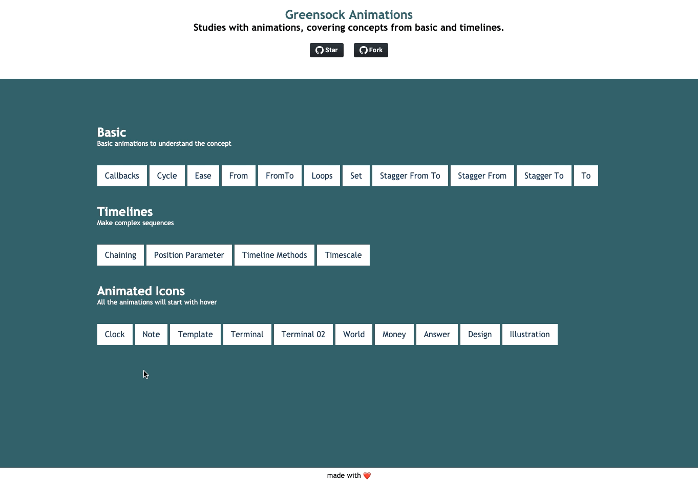

# GreenSock Animations

> [greensock.netlify.com](https://greensock.netlify.com/)



## Requirements

In order to run this project locally, you must have:

- [Nodejs@12.14.0](https://nodejs.org/dist/v12.14.0/)

## Usage

To install all dependencies, run:

```bash
$ npm install
```

### development

To start the **development** mode, run:

```bash
$ npm run dev
```

## License

[MIT License](https://thulioph.mit-license.org/) © Thulio Philipe